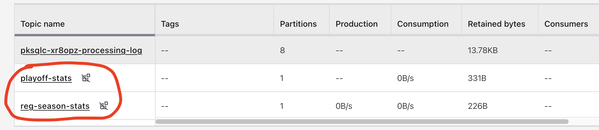
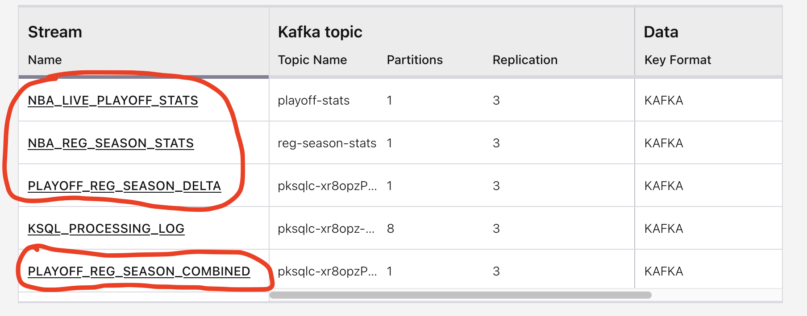
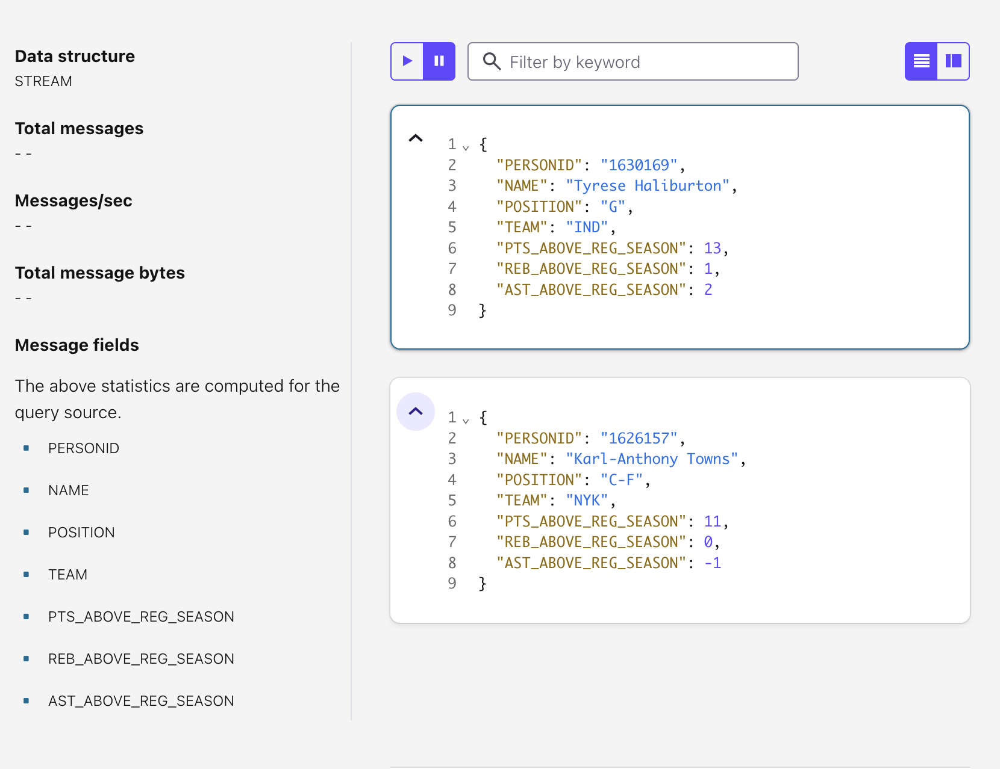

# capstone-project
Final Project for DE Bootcamp

## Generate Data
Start by going to **data_gen.py** and seeing what data for players you get. Notes:
1. The live data element is the current scoreboard (the games currently being played). If there are no games being played currently, it is showing the most recent set of games.
2. We only get the data associated with each team's scoring leader.
3. We then query the NBA API to get the player's current season statistics.
4. This file should generate newline delimited json for the live game (stat leaders) as well as their respective season statistics.

## Produce Topics
Then you run **producer.py** on the command line:
1. Use the appropriate arguments (config file with the correct user and password and the topic you want to publish to). 
2. You also want to modify the ndjson file that producer.py reads in (e.g. player_stats is for the regular season and nba_score is for the playoffs - I have published these datasets to separate topics to correspond to that).
3. Once you have published the messages to the topics your Confluent Topics page should look like this:

## KSQL
Once you have messages published to the topics, you can start to query the data with KSQLDB. Start a cluster in Confluent, and create the streams shown in **queries.sql**. The streams will show in the Streams page in your ksqlDB cluster:

1. The first 2 streams are just mappings of the data published to the 2 topics with player and team data as well as counting statistics for the playoff game and regular season games.
2. The second 2 streams take the data from the playoffs and regular season and take the difference between the 2 to see if the player is performing at a higher level than their regular season performance.

The output from selecting from the final stream should look something like this:

